# Polaris Dance · AI 一键生成 PPT Agent

> 输入一个主题，自动产出一份可直接放映的演示文稿。

[](https://polarisdance.online)
[](https://polarisdance.online)

本仓库只用于展示成果，不含源码。下面的 PDF 全部由我们的 Agent 自动生成（推理程度 low），未做任何人工润色与重排，可直接点击在 GitHub 网页端预览全部页面。

---

## 🎯 这是什么

Polaris Dance 是一套「主题 → 成品 PPT」的 Agent：给一句话主题，Agent 自动完成大纲规划 → 逐页内容撰写 → 页面版式设计。

当前 Agent 主要垂直于**教育领域**，面向教师备课与课堂演示等课件场景；下面四组示例也以教学场景为主（语文 / 数学 / 物理 / 后端技术分享）。

为了说明「当前效果还可以」，我们用 **4 个不同领域主题**，让 Polaris Dance、**豆包（线上 PPT 生成）** 和 **Claude Opus 5.5（直接生成，推理程度 high）** 各自独立生成了一版 PPT，并把三份产物放在一起对比。**对比效果无需下载，直接看下方预览图即可。**

- 🌐 在线体验：[polarisdance.online](https://polarisdance.online)
- 📁 本仓库成果：
  - [`result/`](result/) —— Polaris Dance 生成结果
  - [`compare/`](compare/) —— 豆包、Claude Opus 5.5 同主题生成结果（对照组）
  - [`preview/`](preview/) —— 上述 PDF 的页面预览图（供 README 内嵌展示）

> ⚠️ **访问提示**：演示站点目前**未部署在国内云服务器上**，国内访问的网络状况可能较差（打开慢、加载不稳定）；再叠加当前生成耗时较长，在线体验时请耐心等待。若想快速了解效果，直接浏览本仓库的 PDF 与上方预览图即可。

## 🧠 使用模型

| 环节 | 模型 | 说明 |
| --- | --- | --- |
| 推理 / 内容生成 | **Qwen3.7-Plus** | 理解主题、组织大纲（推理程度 low） |
| 页面配图 | **Wan2.7-Image-Pro** / Wan2.7-Image | 按需生成配图，支撑视觉版式 |

## 📊 效果对比：Polaris Dance vs 豆包 vs Claude Opus 5.5

四组主题的三版成果（均为 8 页 PPT）。下图为每份成果的第 1 页（封面），从左到右依次为：**① 语文 · 朱自清《春》 → ② 数学 · 正弦函数 y = sin x → ③ 物理 · 力 → ④ 后端 · Redis 缓存故障**。

<div align="center">

**Polaris Dance（本 Agent）生成 · 四份封面**

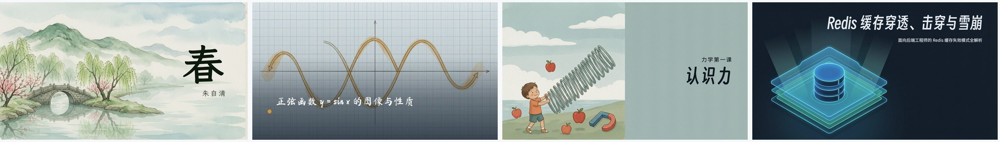

<br/>

**豆包生成 · 四份封面**


<br/>

**Claude Opus 5.5 直接生成 · 四份封面**

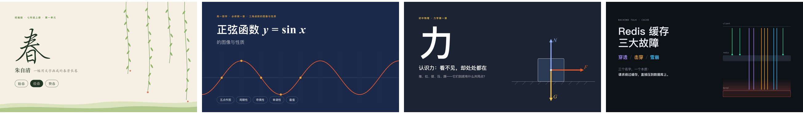

</div>

> 注：三份为各自**独立生成**的版本，页面结构、节奏与风格并不一一对应；下方按页码对齐仅为便于横向比对观感。每份成果的第 1–4 页预览自上而下排列，点击各小节 PDF 链接可查看全部 8 页。

---

### 1️⃣ 语文 · 朱自清《春》

💬 **用户输入**：给初一学生讲朱自清的《春》

<table>
<tr>
<td align="center"><b>🚀 Polaris Dance 生成（第 1–4 页）</b></td>
<td align="center"><b>🎈 豆包生成（第 1–4 页）</b></td>
<td align="center"><b>🤖 Claude Opus 5.5 直出（第 1–4 页）</b></td>
</tr>
<tr>
<td>
<br/>
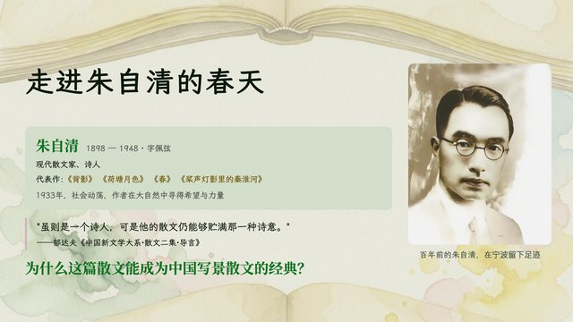<br/>
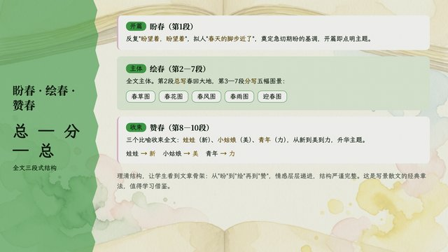<br/>
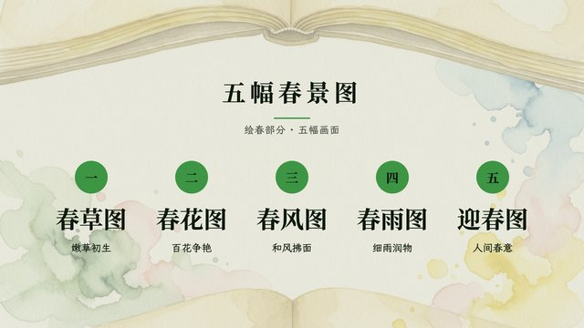
</td>
<td>
<br/>
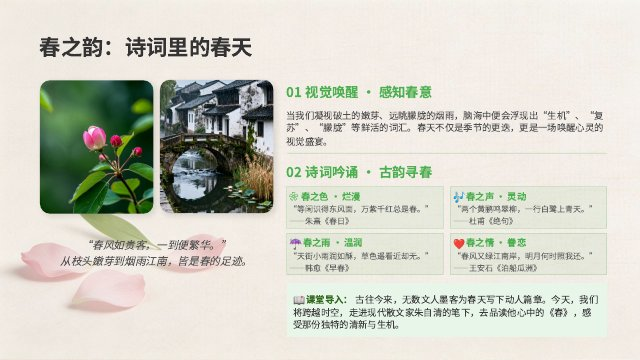<br/>
<br/>
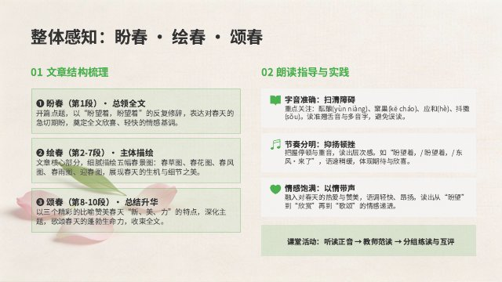
</td>
<td>
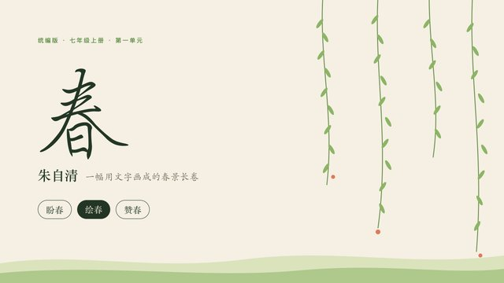<br/>
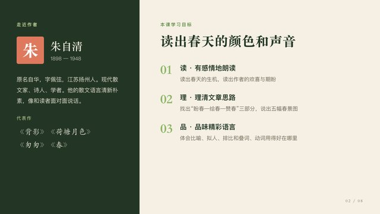<br/>
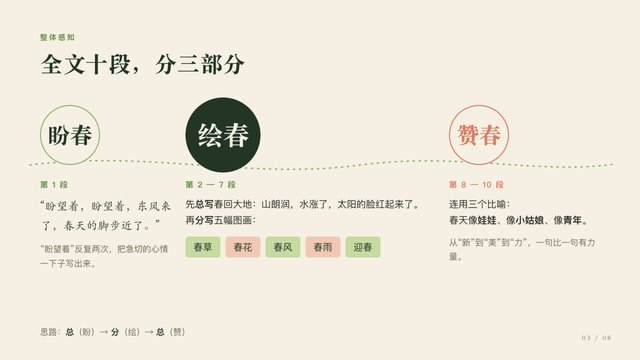<br/>
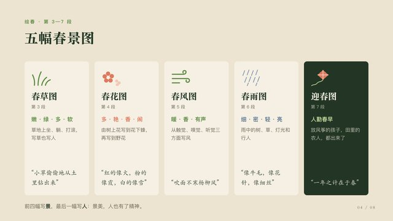
</td>
</tr>
</table>

- 📄 [Polaris Dance 版：`1-春.pdf`](result/1-春.pdf)（8 页 · 16.3 MB）
- 📄 [豆包版：`1-春-豆包.pdf`](compare/1-春-豆包.pdf)（8 页 · 3.0 MB）
- 📄 [Claude Opus 5.5 版：`1-春-opus5.5.pdf`](compare/1-春-opus5.5.pdf)（8 页 · 0.9 MB）

---

### 2️⃣ 数学 · 正弦函数 y = sin x 的图像与性质

💬 **用户输入**：给高一学生讲一节课：正弦函数 y=sin x 的图像与性质。要讲清楚五点作图法、周期性、奇偶性、单调区间和最值，配合图像来讲

<table>
<tr>
<td align="center"><b>🚀 Polaris Dance 生成（第 1–4 页）</b></td>
<td align="center"><b>🎈 豆包生成（第 1–4 页）</b></td>
<td align="center"><b>🤖 Claude Opus 5.5 直出（第 1–4 页）</b></td>
</tr>
<tr>
<td>
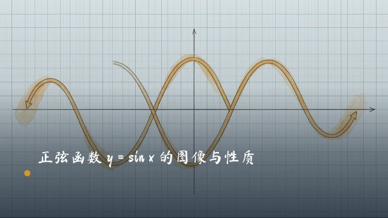<br/>
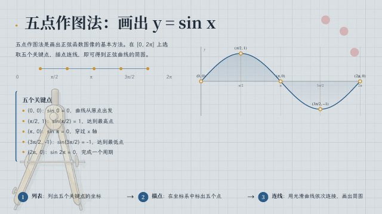<br/>
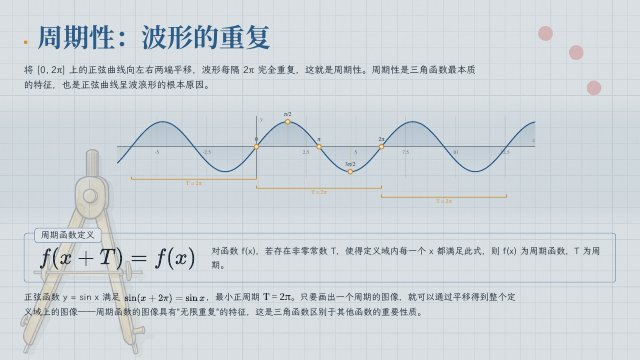<br/>
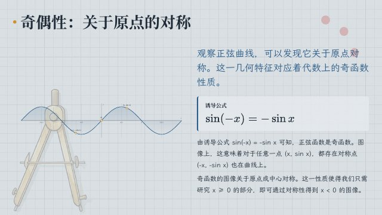
</td>
<td>
<br/>
<br/>
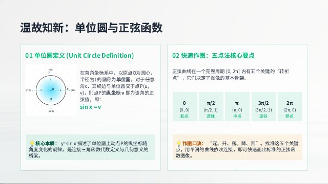<br/>
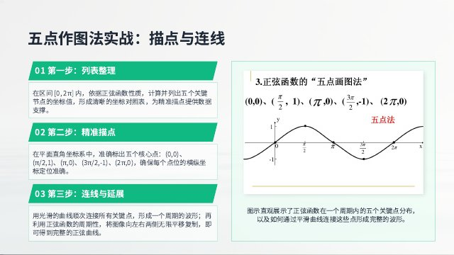
</td>
<td>
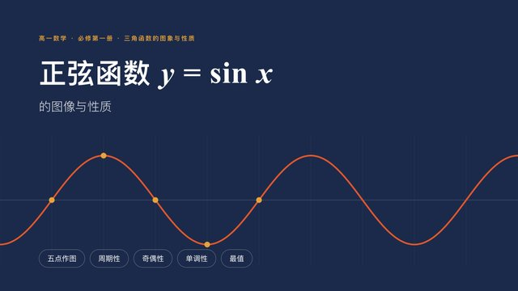<br/>
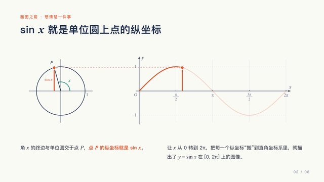<br/>
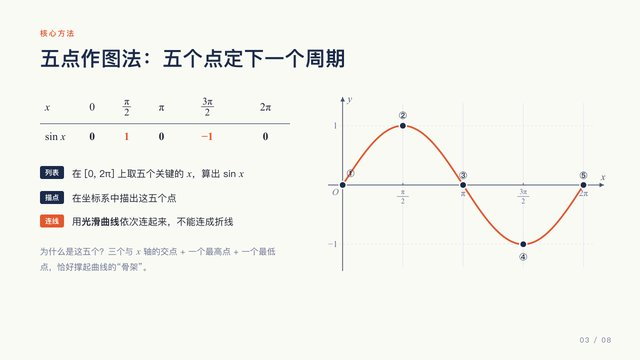<br/>
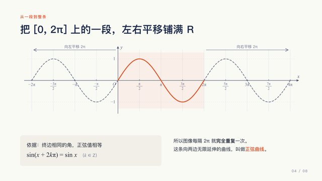
</td>
</tr>
</table>

- 📄 [Polaris Dance 版：`2-数学.pdf`](result/2-数学.pdf)（8 页 · 12.5 MB）
- 📄 [豆包版：`2-数学-豆包.pdf`](compare/2-数学-豆包.pdf)（8 页 · 1.8 MB）
- 📄 [Claude Opus 5.5 版：`2-数学-opus5.5.pdf`](compare/2-数学-opus5.5.pdf)（8 页 · 1.1 MB）

---

### 3️⃣ 物理 · 力学第一课

💬 **用户输入**：给初一学生讲力学第一课

<table>
<tr>
<td align="center"><b>🚀 Polaris Dance 生成（第 1–4 页）</b></td>
<td align="center"><b>🎈 豆包生成（第 1–4 页）</b></td>
<td align="center"><b>🤖 Claude Opus 5.5 直出（第 1–4 页）</b></td>
</tr>
<tr>
<td>
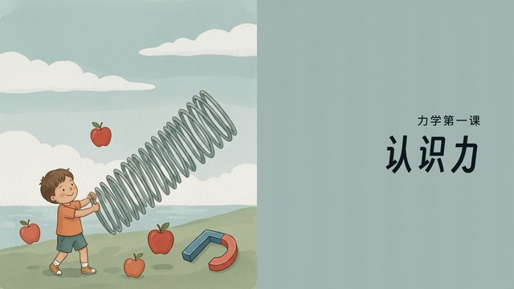<br/>
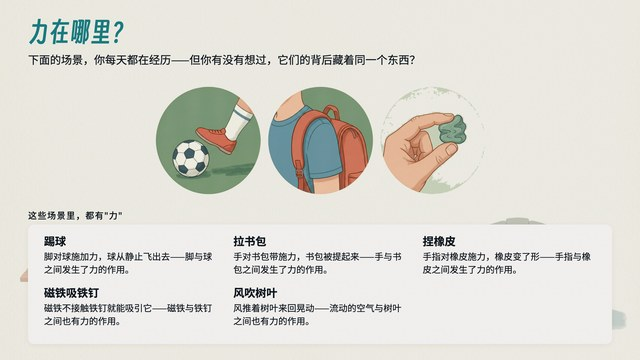<br/>
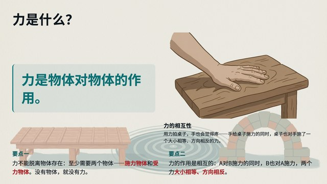<br/>
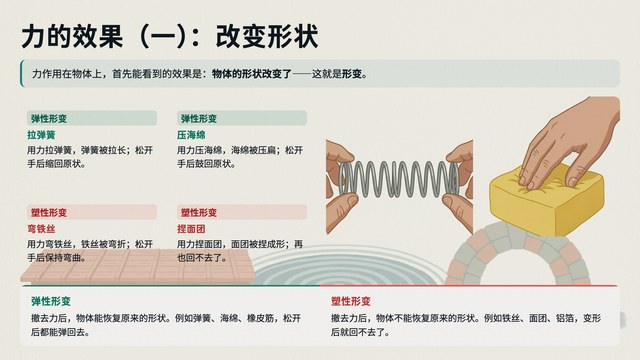
</td>
<td>
<br/>
<br/>
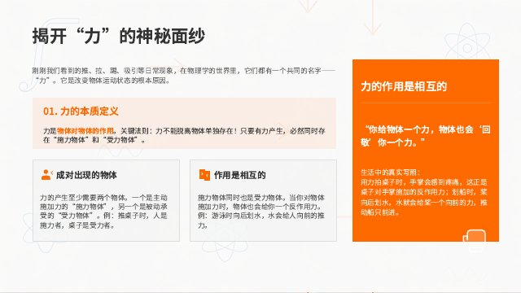<br/>

</td>
<td>
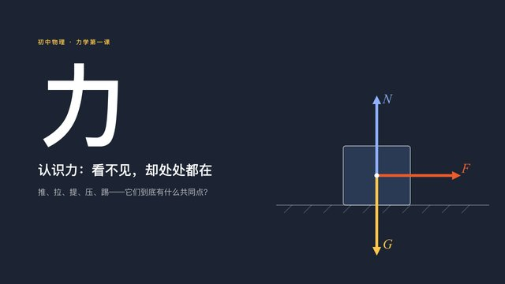<br/>
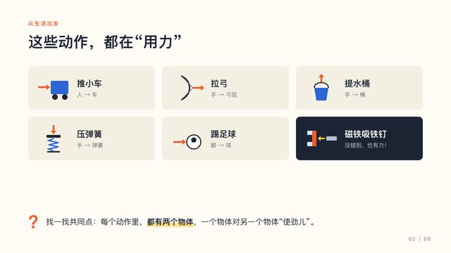<br/>
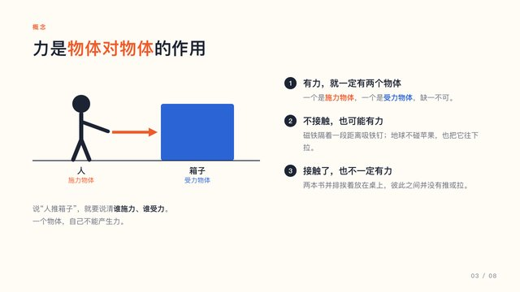<br/>
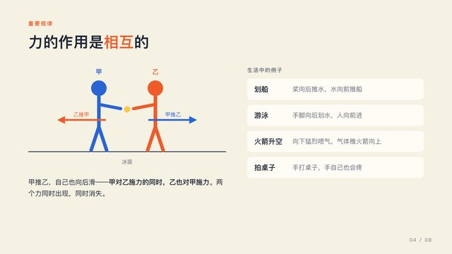
</td>
</tr>
</table>

- 📄 [Polaris Dance 版：`3-物理.pdf`](result/3-物理.pdf)（8 页 · 15.2 MB）
- 📄 [豆包版：`3-物理-豆包.pdf`](compare/3-物理-豆包.pdf)（8 页 · 2.1 MB）
- 📄 [Claude Opus 5.5 版：`3-物理-opus5.5.pdf`](compare/3-物理-opus5.5.pdf)（8 页 · 0.9 MB）

---

### 4️⃣ 后端 · Redis 缓存故障（穿透 / 击穿 / 雪崩）

💬 **用户输入**：给后端工程师讲清楚 Redis 的缓存穿透、缓存击穿和缓存雪崩

<table>
<tr>
<td align="center"><b>🚀 Polaris Dance 生成（第 1–4 页）</b></td>
<td align="center"><b>🎈 豆包生成（第 1–4 页）</b></td>
<td align="center"><b>🤖 Claude Opus 5.5 直出（第 1–4 页）</b></td>
</tr>
<tr>
<td>
<br/>
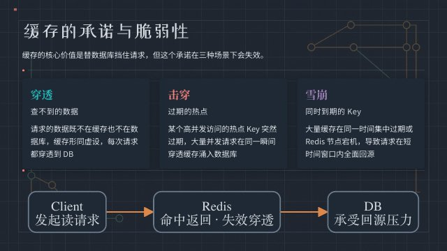<br/>
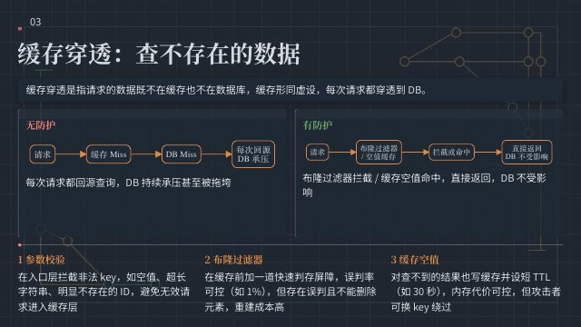<br/>

</td>
<td>
<br/>
<br/>
<br/>

</td>
<td>
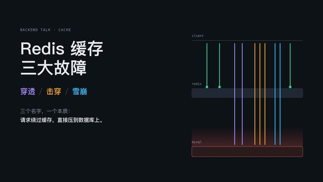<br/>
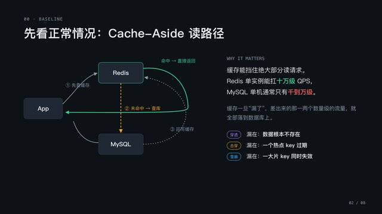<br/>
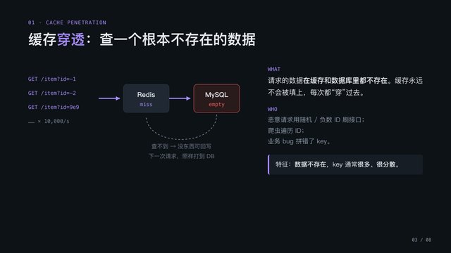<br/>
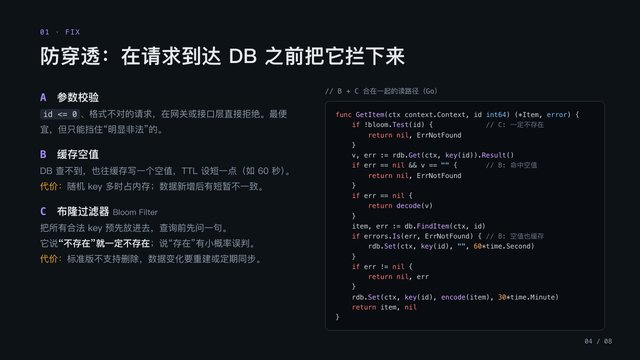
</td>
</tr>
</table>

- 📄 [Polaris Dance 版：`4-redis.pdf`](result/4-redis.pdf)（8 页 · 10.4 MB）
- 📄 [豆包版：`4-redis-豆包.pdf`](compare/4-redis-豆包.pdf)（8 页 · 2.2 MB）
- 📄 [Claude Opus 5.5 版：`4-redis-opus5.5.pdf`](compare/4-redis-opus5.5.pdf)（8 页 · 1.1 MB）

---

## ⚠️ 当前问题与待优化

**现状**：模型推理输出较多，生成速度慢，耗时较长（端到端生成一份 PPT 需要较长时间）。另外，演示站点暂未部署在国内云服务器上，国内访问的网络延迟会进一步放大体感等待时间（见上文「访问提示」）。

**待优化方向**：

- 压缩推理输出，减少非必要内容；
- 优化配图链路，降低配图等待对整体耗时的影响。

> 本仓库中 Polaris Dance 的成果均为推理程度 low 的输出，后续优化完成后会更新同题对比。

## 🗂️ 仓库结构

```
polaris-dance/
├── result/        Polaris Dance 生成结果（Qwen3.7-Plus + Wan2.7-Image-Pro · 推理程度 low）
│   ├── 1-春.pdf        语文 · 朱自清《春》（8 页 · 16.3 MB）
│   ├── 2-数学.pdf      数学 · y = sin x 图像与性质（8 页 · 12.5 MB）
│   ├── 3-物理.pdf      物理 · 力（8 页 · 15.2 MB）
│   └── 4-redis.pdf     后端 · Redis 缓存穿透 / 击穿 / 雪崩（8 页 · 10.4 MB）
├── compare/       对照组：豆包、Claude Opus 5.5 同主题生成结果（各 8 页 × 4 份）
│   ├── *-豆包.pdf
│   └── *-opus5.5.pdf
├── preview/       README 内嵌展示用的页面预览图（含两份封面横图 hero-*.jpg）
└── README.md
```

---

<p align="center">
  🌐 在线体验：<a href="https://polarisdance.online">polarisdance.online</a> &nbsp;·&nbsp;
  由 Qwen3.7-Plus + Wan2.7-Image-Pro 驱动
</p>
